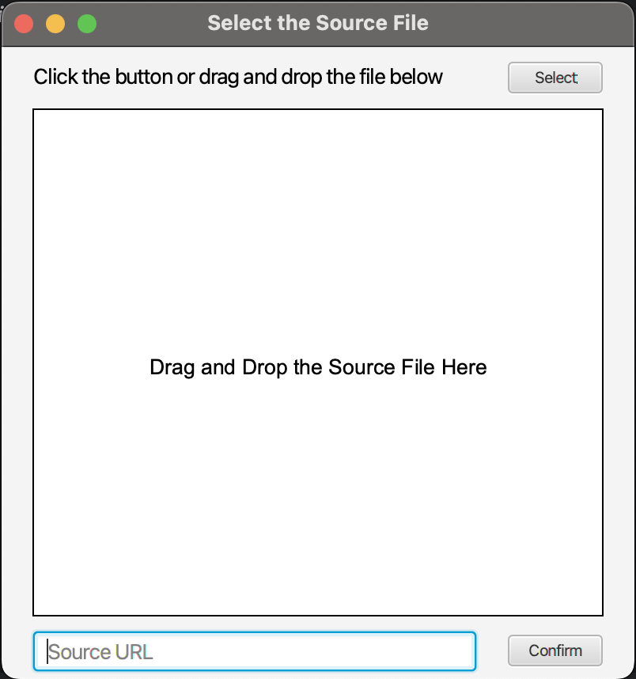
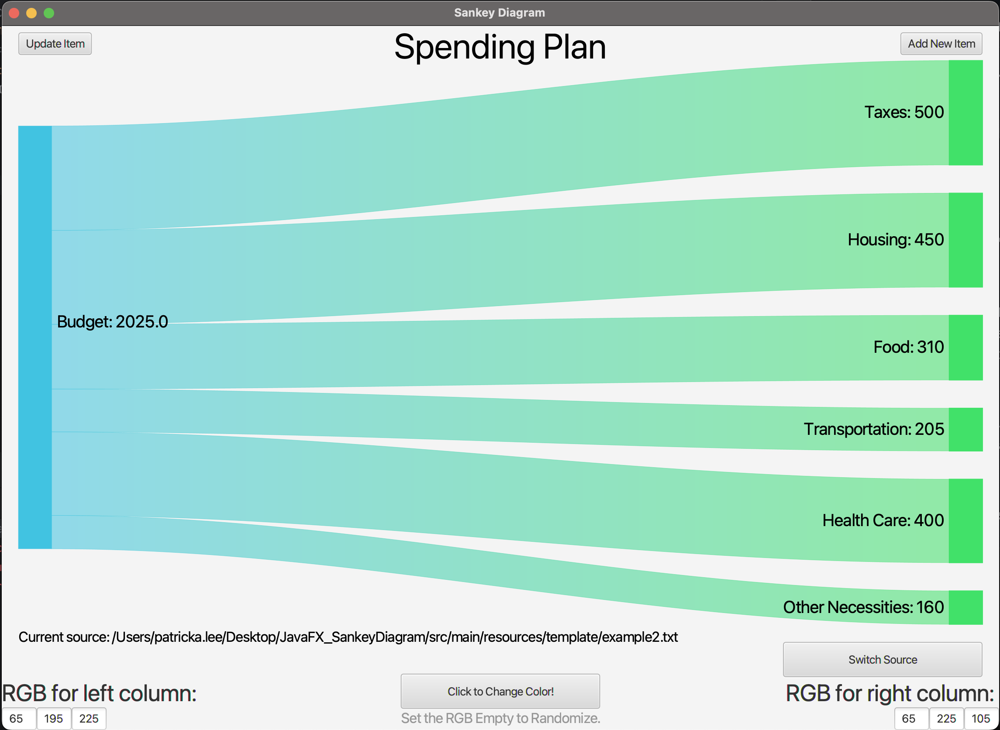

# Basic Sankey Diagram Based on JavaFX

A simple Maven project for the XJTLU ACYR 2023/2024 SEM 1 CPT111 Java Programming Course Work 3.

Main work in: `src/main/java/org/example/CW3_2252294_sankeydiagrams.java`\
Starter class: `src/main/java/org/example/AppStart.java`

## Features
1. Randomly changing or specifying RGB parameters to change the color of each level;
2. Showing tips when moving the mouse on to the RGB TextField;
3. Implementing new sub-items in the chart;
4. Manually editing the title and value of each item, and showing whether these elements are editable or not editable by changing their css styles, such as the TextField element will turn to light gray when it is not editable and turn to regular style when it is editable;
5. Writing updated data in the original file when the window closed;
6. Selecting the source file before the drawing process, including 3 ways of getting the file: select from a FileChooser, drag and drop file to a certain area, and input the absolute path manually;
7. Displaying the absolute path of current source below the diagram;
8. Switching the source file with a switch button at the right of the absolute path of the source;
9. Automatic Resizing.

## User Interface

